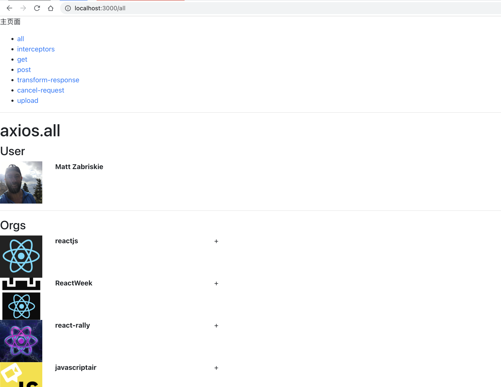
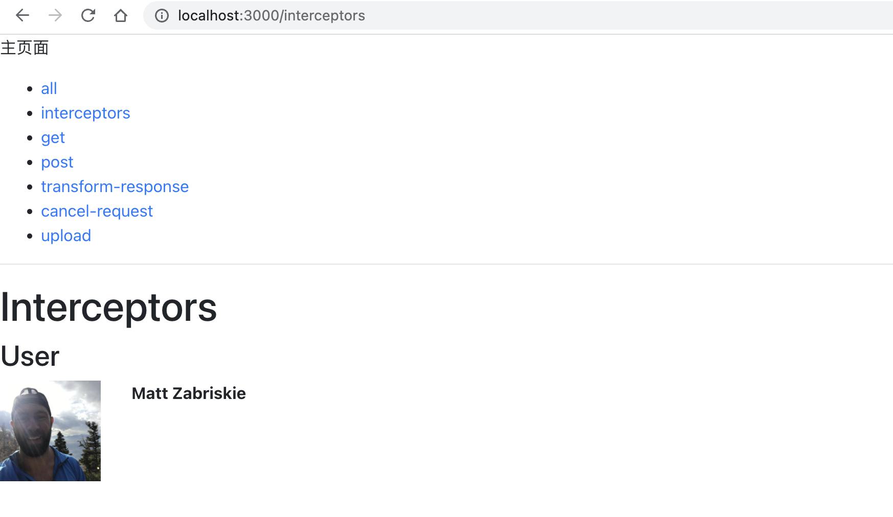
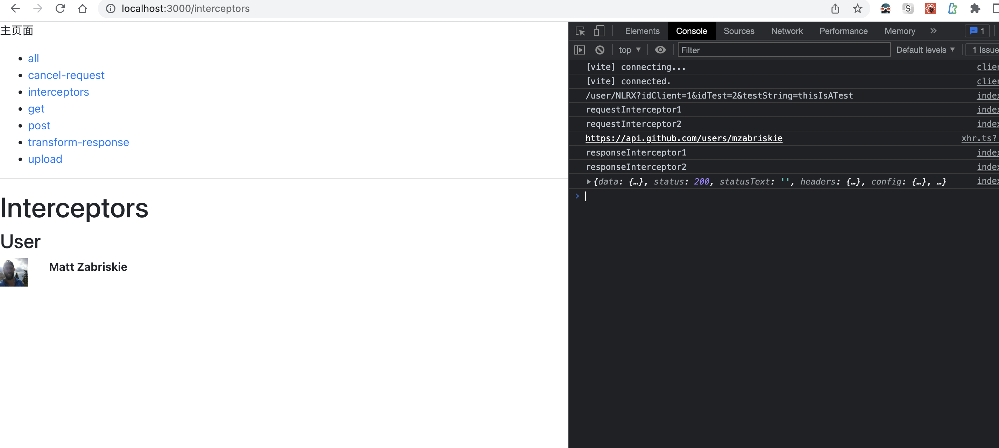
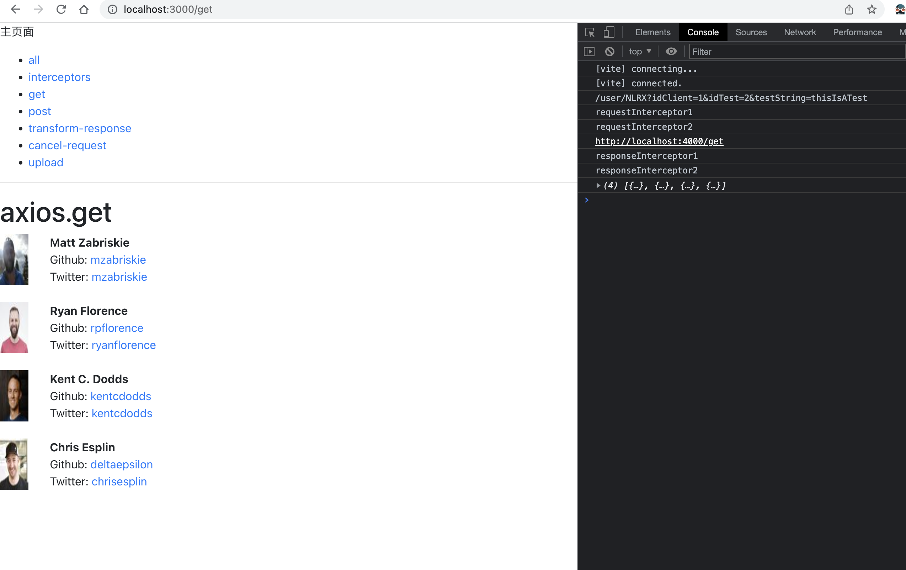
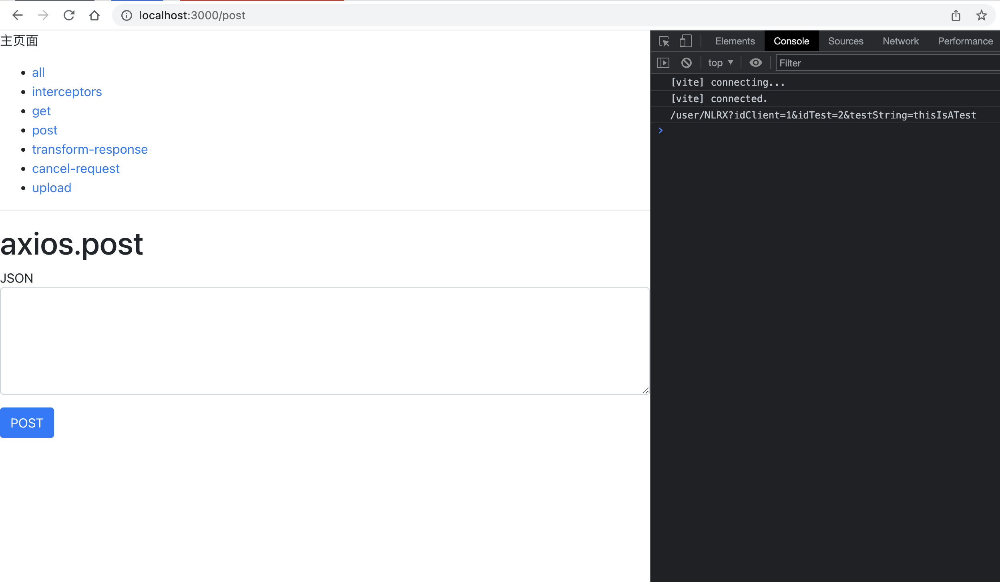
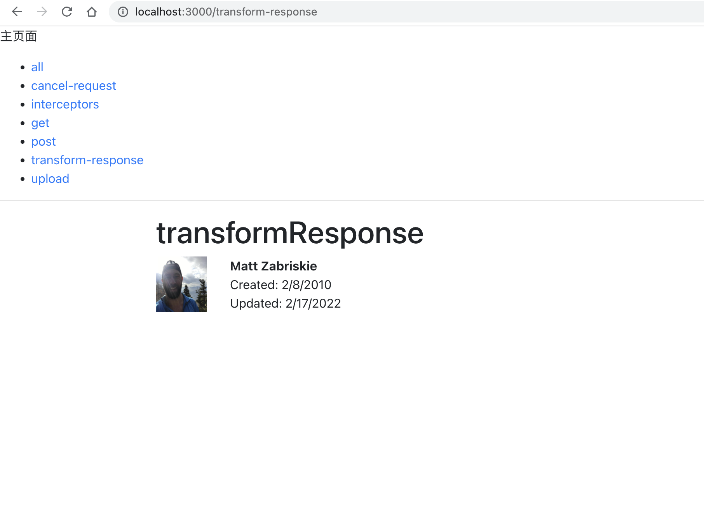
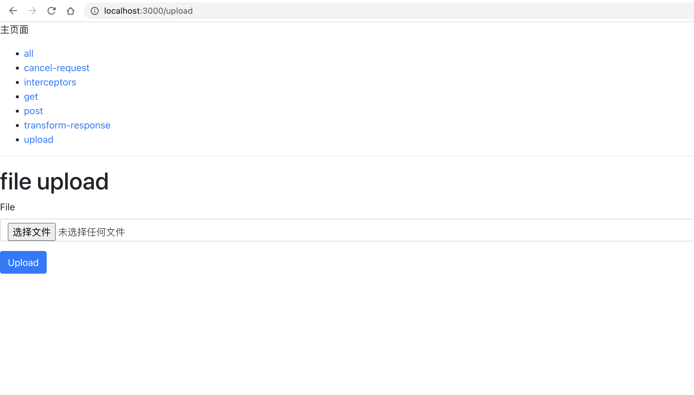

# axios源码分析

## ⌨️ 调试

```shell
# 安装依赖
yarn
# 启动前端环境
yarn dev
# 启动后端环境
yarn server
```

## 🔨 例子

- [axios.all](./src/examples/all/index.tsx)



- [cancelRequest(CancelToken or AbortController)](./src/examples/cancel-request/index.tsx)



- [interceptors](./src/examplesinterceptors/index.tsx)



- [axios.get](./src/examples/get/index.tsx)



- [axios.post](./src/examples/post/index.tsx)



- [transformResponse](./src/examples/transform-response/index.tsx)



- [axios.put & onUploadProgress](./src/examples/upload/index.tsx)


